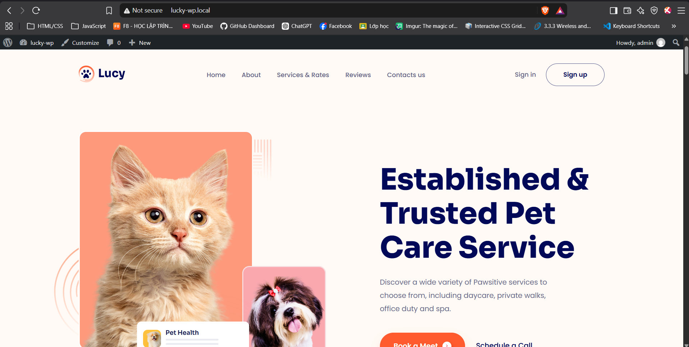
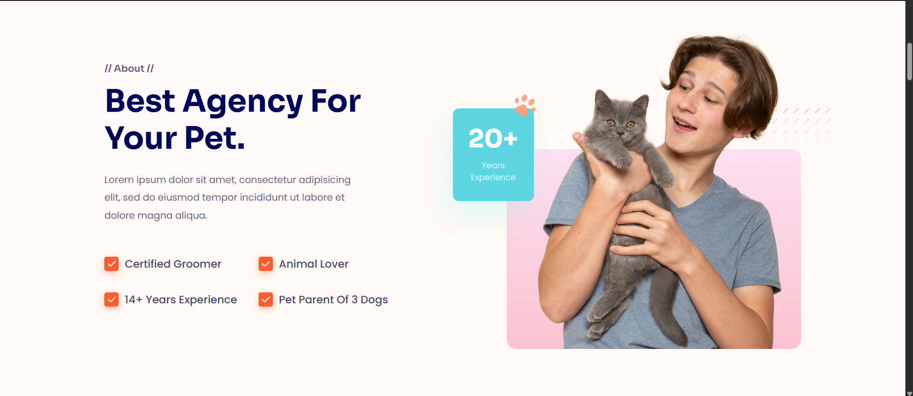
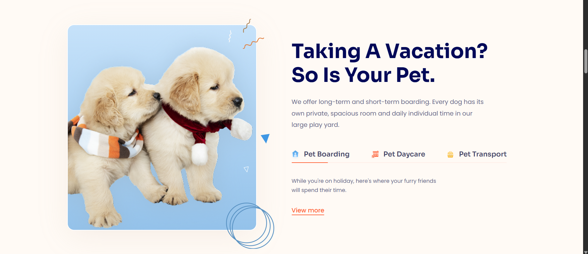
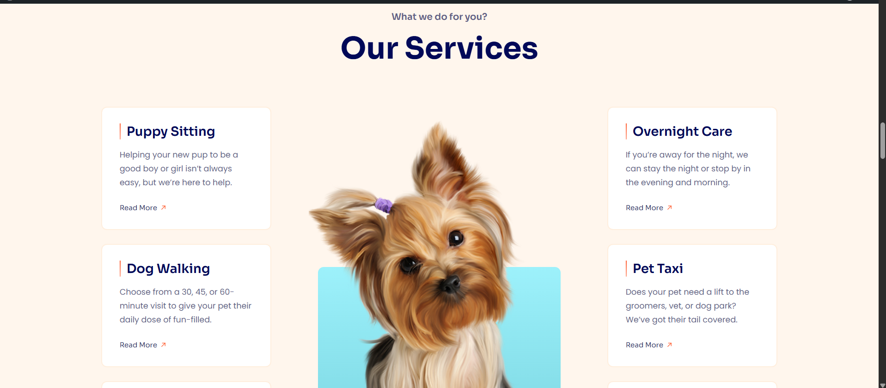
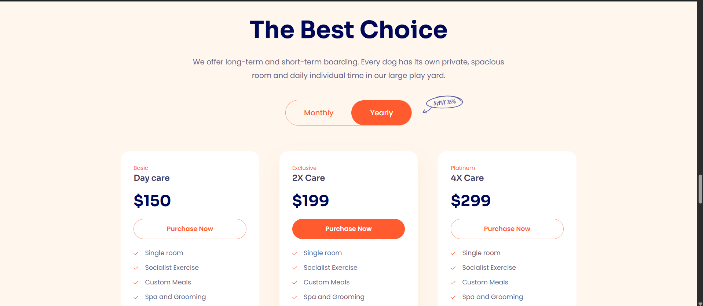
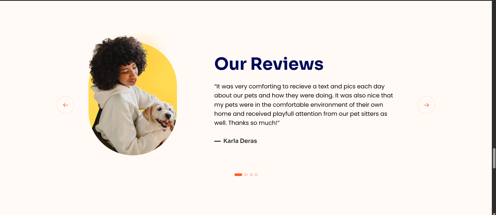
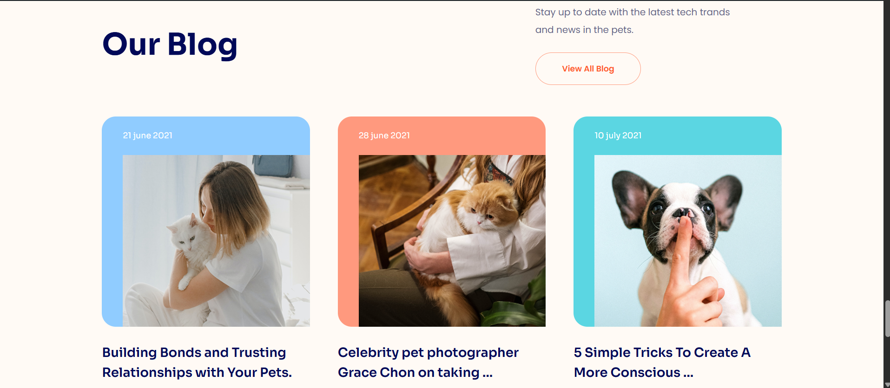
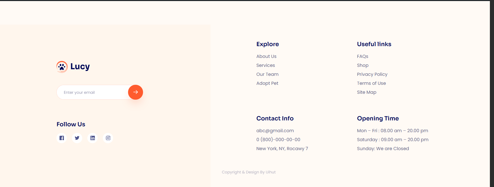

# Lucky WordPress Theme

**Developed by Duong Tuan Khang**

A custom classic WordPress theme converted from a static pet care landing page, built with PHP, HTML5, CSS3, and WordPress APIs.

## Screenshots

### Homepage

### Website Sections

## Features

- Converted a static HTML/CSS landing page into a custom classic WordPress theme.
- Responsive landing page for a pet care service.
- Pixel-perfect visual matching with the original landing page.
- WordPress-managed document title.
- Stylesheets and Google Fonts enqueued through WordPress APIs.
- Original layout and assets preserved.

## Technologies

- PHP
- WordPress
- HTML5
- CSS3

## Installation

1. Copy the `lucky` folder into `wp-content/themes/`.
2. Activate **Lucky** in the WordPress admin dashboard.
3. Open the homepage to view the landing page.

## Project Status

**Completed:** WordPress theme setup, template integration, asset integration, and visual matching.

**Note:** Form submission and placeholder links may require additional implementation.
| Set-Content -Encoding utf8 README.md
